# 🧪 TESTING SCENARIO - Admin Laporan Management

## 📝 Pre-requisite

Sebelum menjalankan testing, pastikan:

✅ Database sudah disetup  
✅ User admin sudah ada dengan role='admin'  
✅ Minimal ada 1 laporan di database  
✅ Server Laravel sudah running (`php artisan serve`)  

---

## 🎯 Scenario 1: View List Laporan

### Manual Testing

**URL:** `http://localhost:8000/admin/laporan`

**Step:**
1. Login dengan user admin (role='admin')
2. Buka URL di atas
3. Amati hasil

**Expected Result:**

| No | Item | Status |
|----|------|--------|
| 1 | Halaman terbuka tanpa error | ✅ |
| 2 | Terlihat title "Manajemen Data Laporan" | ✅ |
| 3 | Terlihat 6 statistics cards (Total, Menunggu, Diproses, dst) | ✅ |
| 4 | Terlihat filter form (Search, Status, Kategori, etc) | ✅ |
| 5 | Terlihat table dengan list laporan | ✅ |
| 6 | Pagination tampil di bawah (jika ada > 15 laporan) | ✅ |
| 7 | Button Edit, View, Delete ada untuk setiap laporan | ✅ |

**Screenshot/Evidence:**
```
┌─────────────────────────────────────────────────────────────┐
│ Manajemen Data Laporan                      [Export CSV]    │
├─────────────────────────────────────────────────────────────┤
│ [Total: 5] [Menunggu: 2] [Diproses: 1] [Selesai: 1] [Ditolak: 1] │
├─────────────────────────────────────────────────────────────┤
│ Search: [________]  Status: [Semua ▼]  Filter [Reset]      │
├─────────────────────────────────────────────────────────────┤
│ No | Judul | Pelapor | Kategori | Status | Tanggal | Aksi  │
├────┼───────┼─────────┼──────────┼────────┼────────┼──────────┤
│ 1  | Jalan | User 1  | Banjir   | Menunggu | 06/05 | 👁 ✏️ 🗑 │
│    | Rusak |         |          |        |       |         │
├────┴───────┴─────────┴──────────┴────────┴────────┴─────────┤
│ Page 1 | Entries: 1-5 of 5                                 │
└─────────────────────────────────────────────────────────────┘
```

---

## 🎯 Scenario 2: Filter & Search Laporan

### Manual Testing

**URL:** `http://localhost:8000/admin/laporan`

**Step:**
1. Di halaman list, gunakan filter
2. Test masing-masing filter:

#### Test A: Filter by Status
- Select Status: "Menunggu"
- Click "Filter"
- Expected: Hanya laporan dengan status Menunggu yang tampil

**Verification:**
```
SELECT COUNT(*) FROM laporans WHERE status = 'Menunggu'
→ Harus sama dengan jumlah laporan yang tampil di UI
```

#### Test B: Search
- Input Search: "Jalan"
- Click "Filter"
- Expected: Hanya laporan dengan judul/deskripsi mengandung "Jalan" yang tampil

#### Test C: Filter Multiple
- Status: "Menunggu"
- Kecamatan: "Bandung Wetan"
- Urgensi: "Tinggi"
- Click "Filter"
- Expected: Laporan yang match semua kriteria tampil

---

## 🎯 Scenario 3: View Detail Laporan

### Manual Testing

**URL:** `http://localhost:8000/admin/laporan/{id}` 

**Step:**
1. Di list laporan, click tombol 👁️ atau judul laporan
2. Amati halaman detail

**Expected Result:**

| Element | Status | Value |
|---------|--------|-------|
| Judul Laporan | ✅ | Harus sesuai data |
| Pelapor | ✅ | Nama user yang membuat laporan |
| Kategori | ✅ | Kategori laporan |
| Status | ✅ | Badge dengan warna sesuai status |
| Urgensi | ✅ | Badge dengan warna sesuai urgensi |
| Deskripsi | ✅ | Teks lengkap laporan |
| Foto | ✅ | Tampil jika ada |
| Lokasi | ✅ | Latitude/Longitude |
| Timeline | ✅ | Menampilkan perubahan status |

**Detail View Layout:**
```
┌──────────────────────────────────────────────────────────┐
│ Detail Laporan (#1)            [Kembali] [Edit]         │
├────────────────────┬──────────────────────────────────┤
│ LEFT COLUMN        │ RIGHT COLUMN                     │
├────────────────────┼──────────────────────────────────┤
│ Judul: Jalan Rusak │ Informasi Pelapor               │
│ Status: Menunggu   │ Nama: User Test                │
│ Urgensi: Tinggi    │ Email: user@test.com           │
│ Kategori: Banjir   │ Telepon: 08xxx                 │
│ Kecamatan: Wetan   │ Kota: Bandung                  │
│                    │                                │
│ Deskripsi:         │ Timeline:                       │
│ "Jalan sangat      │ ⊕ 06/05/2026 Dibuat            │
│  rusak dan         │ ⊕ 06/05/2026 Status Diubah     │
│  berbahaya"        │                                │
│                    │                                │
│ Foto:              │                                │
│ [Gambar]           │                                │
│ (400x300px)        │                                │
└────────────────────┴──────────────────────────────────┘
```

---

## 🎯 Scenario 4: Edit Status Laporan ⭐

### Manual Testing - IMPORTANT

**URL:** `http://localhost:8000/admin/laporan/{id}/edit`

**Step:**
1. Di halaman list, click tombol ✏️ (pencil)
2. Atau dari detail, click tombol "Edit"
3. Halaman edit form akan terbuka

**Expected Result:**

**Sebelum Edit:**
```
Database:
┌────┬────────┬────────────┬──────────┬──────────────────┐
│ id │ status │ admin_id   │ catatan  │ waktu_verifikasi │
├────┼────────┼────────────┼──────────┼──────────────────┤
│ 1  │ Menunggu│ NULL      │ NULL     │ NULL             │
└────┴────────┴────────────┴──────────┴──────────────────┘
```

**Edit Form - Filled:**
```
┌────────────────────────────────────────────────────┐
│ Edit Laporan: Jalan Rusak                         │
├────────────────────────────────────────────────────┤
│                                                    │
│ Status Laporan: [Terverifikasi ▼]                 │
│                                                    │
│ Admin Verifikasi: [Admin Test ▼]                  │
│                                                    │
│ Catatan Verifikasi:                               │
│ ┌──────────────────────────────────────────────┐  │
│ │ Laporan sudah diverifikasi dan valid.        │  │
│ │ Akan dilanjutkan ke tahap berikutnya.        │  │
│ └──────────────────────────────────────────────┘  │
│                                                    │
│ [Simpan Perubahan] [Batal]                        │
└────────────────────────────────────────────────────┘
```

**Step Click "Simpan":**
1. Form di-submit dengan method PUT
2. Controller update laporan
3. Redirect ke halaman detail

**Setelah Edit:**
```
Database:
┌────┬──────────────┬──────────┬────────────────────────────────┬──────────────────┐
│ id │ status       │ admin_id │ catatan                        │ waktu_verifikasi │
├────┼──────────────┼──────────┼────────────────────────────────┼──────────────────┤
│ 1  │ Terverifikasi│ 1        │ Laporan sudah diverifikasi...  │ 2026-05-06 14:30 │
└────┴──────────────┴──────────┴────────────────────────────────┴──────────────────┘
```

**Verification:**

✅ Status berubah dari "Menunggu" → "Terverifikasi"  
✅ Admin ID terisi dengan ID admin yang login  
✅ Catatan verifikasi tersimpan  
✅ waktu_verifikasi otomatis di-set ke waktu saat ini  
✅ Page redirect ke detail laporan  
✅ Detail page menampilkan status baru  

**Database Check:**
```bash
# Di terminal MySQL/SQLite
SELECT id, status, admin_id, catatan_verifikasi, waktu_verifikasi 
FROM laporans WHERE id = 1;

# Result:
# id | status       | admin_id | catatan_verifikasi                    | waktu_verifikasi
# 1  | Terverifikasi| 1        | Laporan sudah diverifikasi dan valid | 2026-05-06 14:30:45
```

---

## 🎯 Scenario 5: Menolak Laporan

### Manual Testing

**URL:** `http://localhost:8000/admin/laporan/{id}/edit`

**Step:**
1. Buka edit form untuk laporan yang ingin ditolak
2. Status: [Ditolak ▼]
3. Alasan Penolakan: "Laporan tidak lengkap dan tidak ada bukti"
4. Click "Simpan Perubahan"

**Expected Result:**

**Sebelum:**
```
Status: Menunggu
Alasan Penolakan: NULL
```

**Sesudah:**
```
Status: Ditolak
Alasan Penolakan: "Laporan tidak lengkap dan tidak ada bukti"
```

**Verification:**
```sql
SELECT status, alasan_penolakan FROM laporans WHERE id = 1;
-- Result: Ditolak | Laporan tidak lengkap dan tidak ada bukti
```

---

## 🎯 Scenario 6: Hapus Laporan 🗑️

### Manual Testing - CRITICAL

**URL:** `http://localhost:8000/admin/laporan`

**Step:**
1. Di list laporan, cari laporan yang akan dihapus
2. Click tombol 🗑️ (trash/delete)
3. Modal konfirmasi akan muncul

**Modal Konfirmasi:**
```
┌──────────────────────────────────────────────────┐
│ Konfirmasi Hapus                             × │
├──────────────────────────────────────────────────┤
│                                                  │
│ Apakah Anda yakin ingin menghapus laporan        │
│ "Jalan Rusak di Jl. Sudirman"?                  │
│                                                  │
│ [Batal]  [Hapus]                                │
└──────────────────────────────────────────────────┘
```

4. Click "Hapus"
5. Form di-submit dengan method DELETE
6. Controller delete laporan
7. Redirect ke list laporan

**Expected Result:**

✅ Modal konfirmasi tampil  
✅ Laporan terhapus dari database  
✅ Laporan tidak tampil di list  
✅ Total laporan berkurang 1  
✅ Redirect ke halaman list  

**Database Verification:**

**Sebelum Delete:**
```sql
SELECT COUNT(*) FROM laporans;
-- Result: 5

SELECT * FROM laporans WHERE id = 1;
-- Result: 1 row
```

**Sesudah Delete:**
```sql
SELECT COUNT(*) FROM laporans;
-- Result: 4

SELECT * FROM laporans WHERE id = 1;
-- Result: 0 rows (TIDAK ADA)
```

---

## 🎯 Scenario 7: Export CSV

### Manual Testing

**URL:** `http://localhost:8000/admin/laporan`

**Step:**
1. (Optional) Atur filter sesuai kebutuhan
2. Click tombol "Export CSV" di atas tabel
3. File akan didownload

**Expected Result:**

✅ File CSV terdownload dengan nama format: `laporan_YYYY-MM-DD.csv`  
✅ File berisi header kolom: ID, Judul, Pelapor, Email, Kategori, Kecamatan, Status, Urgensi, Tanggal, Catatan  
✅ Setiap baris berisi data laporan  

**Sample CSV Content:**
```csv
ID,Judul,Pelapor,Email,Kategori,Kecamatan,Status,Urgensi,Tanggal Dibuat,Catatan
"1","Jalan Rusak di Jl. Sudirman","User Test","user@test.com","Banjir","Bandung Wetan","Terverifikasi","Tinggi","2026-05-06 14:30","Laporan sudah diverifikasi"
"2","Fasilitas Rusak","User Test","user@test.com","Jembatan Rusak","Bandung Utara","Menunggu","Sedang","2026-05-06 10:15","-"
```

**Open in Excel:**
- Download file
- Open dengan Excel / Google Sheets
- Data akan tampil dalam table yang rapi

---

## 📊 Automated Testing (Gunakan PHPUnit)

Setelah dependencies terinstall, jalankan:

```bash
# Run semua tests
php artisan test

# Run test file ini saja
php artisan test tests/Feature/AdminLaporanManagementTest.php

# Run test tertentu
php artisan test tests/Feature/AdminLaporanManagementTest.php --filter=test_admin_can_update_laporan_status

# Run dengan verbose
php artisan test -v

# Run dengan coverage report
php artisan test --coverage-html=tests/coverage
```

---

## ✅ Testing Checklist

Gunakan checklist ini saat melakukan manual testing:

### List & Filter
- [ ] List laporan tampil dengan benar
- [ ] Statistics cards menampilkan angka yang benar
- [ ] Filter by status bekerja
- [ ] Filter by kategori bekerja
- [ ] Filter by kecamatan bekerja
- [ ] Filter by urgensi bekerja
- [ ] Filter by date range bekerja
- [ ] Search by judul/deskripsi bekerja
- [ ] Sort bekerja
- [ ] Pagination bekerja dengan 15 per halaman

### View Detail
- [ ] Detail halaman terbuka
- [ ] Semua informasi laporan terlihat
- [ ] Informasi pelapor lengkap
- [ ] Timeline tampil

### Edit
- [ ] Form edit terbuka
- [ ] Status dropdown menampilkan semua status
- [ ] Admin dropdown menampilkan semua admin
- [ ] Form submit mengubah data di database
- [ ] waktu_verifikasi otomatis di-set

### Delete
- [ ] Modal konfirmasi tampil
- [ ] Laporan terhapus dari database
- [ ] List di-update (laporan hilang)
- [ ] Total laporan berkurang

### Export
- [ ] File CSV terdownload
- [ ] CSV punya header yang benar
- [ ] CSV berisi semua laporan
- [ ] Data di CSV sesuai database

### Security
- [ ] Non-admin user tidak bisa akses
- [ ] Form CSRF token ada
- [ ] Input validation bekerja
- [ ] Error handling bekerja

---

## 🎬 Automatic Testing Flow

```mermaid
graph LR
    A["Test Setup<br/>Create Test Data"] --> B["Test 1<br/>View List"]
    B --> C["Test 2<br/>Access Control"]
    C --> D["Test 3<br/>View Detail"]
    D --> E["Test 4<br/>Open Edit"]
    E --> F["Test 5<br/>Update Status ⭐"]
    F --> G["Test 6<br/>Add Note"]
    G --> H["Test 7<br/>Reject Laporan"]
    H --> I["Test 8<br/>Delete ⭐"]
    I --> J["Test 9<br/>Filter"]
    J --> K["Test 10<br/>Search"]
    K --> L["Test 11<br/>Export CSV"]
    L --> M["Test 12<br/>Statistics"]
    M --> N["Teardown<br/>Cleanup"]
    
    style F fill:#ff9999
    style I fill:#ff9999
    style A fill:#99ccff
    style N fill:#99ccff
```



---

## 📋 Expected Test Results

```
PASS  Tests\Feature\AdminLaporanManagementTest
  ✅ admin can view laporan list
  ✅ non admin cannot access admin laporan
  ✅ admin can view laporan detail
  ✅ admin can open edit form
  ✅ admin can update laporan status
  ✅ admin can add verification note
  ✅ admin can reject laporan with reason
  ✅ admin can delete laporan
  ✅ admin can filter laporan by status
  ✅ admin can search laporan
  ✅ admin can export laporan to csv
  ✅ admin can get statistics
  ✅ verification time is set on status change
  ✅ admin can assign other admin
  ✅ pagination works correctly

Tests:    15 passed (2.234s)
```

---

**Status:** ✅ Ready for Manual & Automated Testing  
**Last Updated:** 2026-05-06
